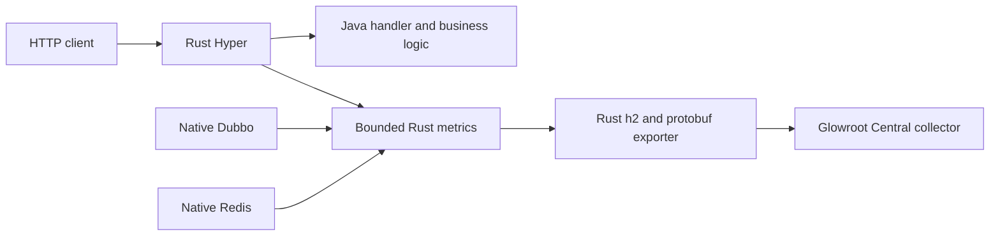

# Java-Rust Glowroot Micro Agent

[English](README.md) | [Turkish](README.tr.md)

[](https://github.com/esasmer-dou/java-rust-glowroot-agent/actions/workflows/ci.yml)
[](https://github.com/esasmer-dou/java-rust-glowroot-agent/releases)

`java-rust-glowroot-agent` sends bounded telemetry from a Rust-Java REST application to a Glowroot
Central collector. Java handlers, services, validation, database access, and business logic do not
change. The existing Rust native runtime records and exports the telemetry.

## Release Status

`0.1.0-rc1` is the first release candidate for the optional bootstrap JAR. It requires the
coordinated Rust-Java REST development runtime with native ABI `28`. The published Rust-Java REST
`4.3.0` runtime uses ABI `26` and cannot enable this telemetry path.

The JAR is not the telemetry engine. It only translates `-javaagent` arguments into framework
properties. For the smallest resident footprint, do not add the JAR. Configure the compatible
native runtime directly with properties or environment variables.

## Deployment Boundary

The existing Glowroot Central/collector stays unchanged. This project does not provide or deploy a
new collector, database, or UI. The only production change is on each Rust-Java application:

| Runtime part | What changes? |
| --- | --- |
| Existing Glowroot Central/collector | Nothing; keep the current deployment and storage |
| Rust-Java application | Enable telemetry with framework properties or environment variables |
| Rust-Java native runtime | Use the coordinated framework binary containing the `glowroot` capability |
| Optional convenience JAR | Translates `-javaagent` arguments; it is not part of the hard-budget production path |
| Java handlers and services | Nothing |
| Benchmark mock collector | Test-only; never deploy it to production |

The hard-budget production path starts telemetry directly in the Rust engine already loaded by the
Rust-Java framework. No Java instrumentation agent is required. The optional JAR only translates
`-javaagent` arguments into the same framework properties. The Rust engine aggregates and exports
telemetry using the existing Glowroot collector wire contract.

This project is intentionally not a smaller copy of the full Glowroot Java agent. It is a
framework-specific micro agent for services where request latency and RSS are strict constraints.
See [Architecture And Production Boundary](docs/ARCHITECTURE.md) for the upstream analysis,
failure contract, memory budget, and deliberately unsupported surfaces.
For the file-by-file upstream review and rejected alternatives, read
[Upstream Glowroot Analysis And Design Decision](docs/UPSTREAM_ANALYSIS.md).
For reproducible footprint, protocol, and performance-gate evidence, read
[Validation Evidence](docs/VALIDATION.md).

## Start Here

| You need | Use |
| --- | --- |
| Route latency, throughput, error rate, RSS, and thread count with very low overhead | This micro agent |
| Native Dubbo and native Redis aggregate timings | This micro agent |
| Arbitrary method tracing, JDBC SQL capture, JMX, profiling, or bytecode weaving | Full Glowroot agent |
| TLS or mTLS from the pod to the collector | Service-mesh or localhost TLS sidecar in front of this agent |

## Runtime Shape



The production path does not install a Java agent or class transformer. The optional convenience
JAR contains one bootstrap class and no runtime dependencies. Protobuf encoding, HTTP/2, sampling,
trace buffering, reconnect, and export run in the existing Rust native runtime.

## Supported Telemetry

| Telemetry | Behavior |
| --- | --- |
| HTTP route count and duration | Weighted bounded sampling; route names come from the build-time route table |
| HTTP `5xx` count | Exact; errors are never hidden by sampling |
| Slow and failed HTTP traces | Bounded queue; no request body, headers, query values, or personal data is copied |
| Native Dubbo calls | Aggregate count, duration, and errors |
| Native Redis reads and writes | Separate aggregate count, duration, and errors |
| Process RSS and thread count | Collected once per export interval |
| Exporter health | Connection, reconnect, failure, dropped interval, transaction, trace, and route counters |

The micro agent does not capture arbitrary Java methods, SQL text, stack traces, log events, JMX
attributes, thread profiles, heap dumps, or remote configuration. Adding those surfaces would
require instrumentation, class loading, queues, and retained state that conflict with the memory
budget.

## Five-Minute Setup

Use the coordinated Rust-Java REST runtime that contains the `glowroot` native capability. Release
candidate `0.1.0-rc1` uses REST native ABI `28`; do not combine it with the published `4.3.0` ABI
`26` binary.

```powershell
java `
  -Dreactor.glowroot.enabled=true `
  -Dreactor.glowroot.collector.address=http://127.0.0.1:8181 `
  -Dreactor.glowroot.agent.id=catalog::local `
  -Dreactor.glowroot.application.name=catalog-api `
  -jar your-application.jar
```

The same values can be stored in `rust-spring.properties`:

```properties
reactor.glowroot.enabled=true
reactor.glowroot.profile=micro
reactor.glowroot.collector.address=http://127.0.0.1:8181
reactor.glowroot.agent.id=catalog::local
reactor.glowroot.application.name=catalog-api
reactor.glowroot.http.sample-rate=256
reactor.glowroot.trace.slow-threshold-ms=500
reactor.glowroot.trace.capacity=0
reactor.glowroot.max-routes=64
reactor.glowroot.max-export-bytes=65536
```

Configuration precedence is:

1. JVM `-Dreactor.glowroot...` system properties.
2. Optional `-javaagent:...=key=value` arguments, when the convenience JAR is used.
3. Environment variables such as `REACTOR_GLOWROOT_AGENT_ID`.
4. External `rust-spring.properties` overlays.
5. Classpath defaults.

Invalid configuration fails application startup. A valid configuration with an unavailable
collector does not stop HTTP traffic.

## Optional Maven Package

Skip this section when you use the recommended properties/environment path. The package is useful
only when your deployment standard requires `-javaagent` syntax.

GitHub Packages requires authentication even though this repository is public. Create a GitHub
token with `read:packages`, then add it to `~/.m2/settings.xml`:

```xml
<settings>
  <servers>
    <server>
      <id>github</id>
      <username>YOUR_GITHUB_USERNAME</username>
      <password>YOUR_GITHUB_PACKAGES_TOKEN</password>
    </server>
  </servers>
</settings>
```

Add the GitHub Packages repository and the runtime-scoped bootstrap dependency to your POM:

```xml
<repositories>
  <repository>
    <id>github</id>
    <url>https://maven.pkg.github.com/esasmer-dou/java-rust-glowroot-agent</url>
  </repository>
</repositories>

<dependencies>
  <dependency>
    <groupId>com.reactor</groupId>
    <artifactId>java-rust-glowroot-agent</artifactId>
    <version>0.1.0-rc1</version>
    <scope>runtime</scope>
  </dependency>
</dependencies>
```

Run with the resolved JAR only when you want the convenience bootstrap:

```bash
java \
  -javaagent:$HOME/.m2/repository/com/reactor/java-rust-glowroot-agent/0.1.0-rc1/java-rust-glowroot-agent-0.1.0-rc1.jar=collector=glowroot-collector:8181,agent-id=catalog::pod-1 \
  -jar your-application.jar
```

An existing `-Dreactor.glowroot.*` property wins over the matching `-javaagent` argument. You can
therefore keep environment-specific values outside the image.

## Kubernetes Example

Use one stable agent id per pod. The pod name is a practical leaf id. A prefix ending with `::`
creates a Glowroot rollup hierarchy.

No agent JAR is required for the hard-budget path. Keep the existing application image layout and
configure the coordinated native runtime. Do not change the collector image or deployment:

```yaml
spec:
  template:
    spec:
      containers:
        - name: catalog-api
          image: registry.example/catalog-api:1.0.0
          env:
            - name: REACTOR_GLOWROOT_ENABLED
              value: "true"
            - name: REACTOR_GLOWROOT_COLLECTOR_ADDRESS
              value: "http://glowroot-collector.observability.svc.cluster.local:8181"
            - name: REACTOR_GLOWROOT_AGENT_ID
              valueFrom:
                fieldRef:
                  fieldPath: metadata.name
            - name: REACTOR_GLOWROOT_APPLICATION_NAME
              value: "catalog-api"
            - name: REACTOR_GLOWROOT_HTTP_SAMPLE_RATE
              value: "256"
            - name: REACTOR_GLOWROOT_TRACE_CAPACITY
              value: "0"
```

The native micro transport is plaintext HTTP/2. Keep it on a trusted cluster network. When
encryption or client identity is required, send to a localhost sidecar and let the sidecar provide
TLS or mTLS. Do not expose the plaintext collector port publicly.

The hard-memory profile resolves the collector name once during startup and retains at most four
unique IP addresses. Use a normal Kubernetes `ClusterIP` Service, or a localhost sidecar address.
Do not point this profile at a headless Service whose endpoint IPs are expected to change while the
pod is running. Restart the pod after changing collector DNS. Startup fails when DNS returns no
address or more than four unique addresses; this prevents a dynamic resolver thread and unbounded
address storage from entering the application.

## Choose A Sampling Recipe

`reactor.glowroot.http.sample-rate=N` records roughly one successful request out of `N` and reports
it with weight `N`. It accepts powers of two from `1` to `1024`. HTTP errors remain exact.

| Workload | Start with | Trace capacity | Why |
| --- | ---: | ---: | --- |
| Low traffic, exact aggregate detail matters | `1` or `8` | `0` | More exact latency distribution without retaining traces |
| Normal or high API traffic | `256` | `0` | Current micro default; keeps aggregate, error, RSS, thread, Dubbo, and Redis telemetry bounded |
| More detailed staging latency distribution | `64` or `128` | `0` | More successful requests update route histograms; verify p99 before production use |
| Incident investigation for one staging pod | `8` | `16` or `32` | Adds bounded slow/error traces; enable only after an A/B p99 and RSS check |

Do not use a large sample rate for a route that receives only a few calls per minute if exact
minute-by-minute counts are required. Use `1` for that service or use application business metrics.
The default is deliberately aggregate-first. Setting `trace.capacity` above `0` allocates bounded
trace state and changes the footprint contract, so treat it as an explicit operational choice.

## Configuration Reference

| Property | Default | Bound | Purpose |
| --- | ---: | ---: | --- |
| `reactor.glowroot.enabled` | `false` | boolean | Enables the native telemetry engine |
| `reactor.glowroot.profile` | `micro` | `micro` only | Selects the bounded feature set |
| `reactor.glowroot.collector.address` | `http://127.0.0.1:8181` | max 512 bytes; max 4 startup-resolved IPs | Plaintext h2 collector endpoint; use stable `ClusterIP` or localhost |
| `reactor.glowroot.agent.id` | empty | 1-256 bytes | Required Glowroot agent/rollup id |
| `reactor.glowroot.application.name` | `reactor.application.name` | 1-128 bytes | Display name sent in read-only agent config |
| `reactor.glowroot.hostname` | `HOSTNAME` | max 255 bytes | Host/pod identity |
| `reactor.glowroot.export.interval-ms` | `60000` | 60000-3600000, multiple of 60000 | Aggregate and gauge interval |
| `reactor.glowroot.connect-timeout-ms` | `1000` | 100-30000 | TCP/h2 connection timeout |
| `reactor.glowroot.request-timeout-ms` | `2000` | 100-30000 | Whole gRPC request lifecycle timeout |
| `reactor.glowroot.trace.slow-threshold-ms` | `500` | 1-3600000 | Slow request trace threshold |
| `reactor.glowroot.http.sample-rate` | `256` | power of two, 1-1024 | Successful HTTP aggregate sampling; HTTP `5xx` remains exact |
| `reactor.glowroot.trace.capacity` | `0` | 0-32 | Bounded slow/error trace queue; `0` allocates no trace queue |
| `reactor.glowroot.max-routes` | `64` | 1-64 | Maximum HTTP route metric slots in the 1 MiB profile |
| `reactor.glowroot.max-export-bytes` | `65536` | 16384-65536 | Hard limit per encoded collector request in the 1 MiB profile |

Every property also has an environment form. Replace dots and hyphens with underscores and use
uppercase. Example: `reactor.glowroot.max-export-bytes` becomes
`REACTOR_GLOWROOT_MAX_EXPORT_BYTES`.

## Failure And Overload Behavior

- Collector connection and gRPC calls have timeouts.
- Reconnect uses bounded exponential backoff from 250 ms to 30 seconds.
- The HTTP path never waits for the collector.
- Trace queues and route tables have hard caps.
- An interval that cannot be exported is dropped at its rollup boundary. It is not retained
  indefinitely and is visible in diagnostics.
- Oversized collector messages are rejected locally instead of growing memory.
- Agent configuration sent to Glowroot is read-only; remote collector configuration is ignored.

Inspect health without looking at application logs:

```bash
curl -s http://localhost:8080/diagnostics/glowroot
curl -s http://localhost:8080/metrics | grep reactor_glowroot
```

Important fields are `connected`, `collector_dns_mode`, `resolved_collector_addresses`,
`export_failure`, `dropped_intervals`, `dropped_transactions`, `dropped_traces`, `dropped_routes`,
and `last_error_code`.

## Performance Gate

The enforceable agent-attributed boundary is a hard `1 MiB`. The Rust startup gate admits at most
`384 KiB` of calculated state and transport reserves, leaving `640 KiB` for native feature pages
and allocator residency. Configuration above this boundary fails startup. No property can raise it.

This source gate is necessary, but it is not sufficient to certify total container memory.
Container `memory.current` also includes OpenJ9 JIT, GC, page cache, kernel socket memory, and
allocator residency. The release gate therefore checks every observed maximum, not only medians.
A favourable median cannot be presented as a deterministic maximum.
Use the same image with telemetry disabled and enabled. Compare Linux process `VmRSS`, cgroup
working set, useful HTTP 200 RPS, p99, and `503` rate. Every endpoint/concurrency cell must pass;
favourable aggregate medians cannot hide an unstable cell.

```powershell
.\benchmark\glowroot_gate.ps1 `
  -PairRepeats 4 `
  -ConcurrencyLevels "64,256" `
  -EndpointClasses "small-json-direct,direct-json-writer,raw-json" `
  -Duration "20s" `
  -Warmup "8s" `
  -FailOnGate
```

The embedded production boundary is at most `+3.00 MiB` for every observed process `VmRSS`, smaps
RSS, and cgroup-current paired delta, with no additional thread. This conservative artifact gate is
separate from the stricter `1 MiB` agent-owned source budget. Performance cells allow at most `2%`
useful HTTP 200 RPS regression and at most `10%` p99 regression. High coefficient of variation
produces `INCONCLUSIVE`, not a pass.

Release-grade scripts also require a quiet Windows host before starting load: average CPU at most
`15%`, peak CPU at most `40%`, and free virtual memory at least `3072 MiB`. If preflight fails, wait
or use a dedicated runner. Do not bypass it for release evidence.

The current exact-source attribution run used three balanced CPU-slot phases and exactly `4,096`
requests per endpoint and variant. The script fingerprinted the native source tree before building
the feature-disabled SO and rejected stale build output. The embedded-native configuration has
`358,531` bytes of bounded state and reserves. Adding measured native feature pages produces an
attributed ceiling of `0.694 MiB`, with `0` additional threads.

The deterministic agent-owned budget and the independent-process resident gate are both **PASS**.
Observed embedded-native medians were `VmRSS +1.676 MiB`, smaps RSS `+1.711 MiB`, and cgroup current
`+0.461 MiB`. The largest paired deltas were `VmRSS +1.742 MiB`, smaps RSS `+1.817 MiB`, and cgroup
current `+1.754 MiB`; thread delta remained `0`. These process values include JVM and allocator
noise, so they are evidence for the `3 MiB` resident boundary, not a replacement for the source-owned
allocation contract.

Tracked release evidence is available under
[`docs/evidence/0.1.0-rc1`](docs/evidence/0.1.0-rc1/README.md). Generated benchmark workspaces remain
ignored so raw logs and temporary containers do not enter the runtime repository.

The optional convenience JAR is not certified for the hard-budget production path. Its observed
maximum reached about `3.055 MiB` for process/smaps RSS even though its source-attributed ceiling was
`0.741 MiB`. Use native properties or environment variables when the resident-memory boundary is
strict.

With the current default sample rate `256`, the focused c256 small-direct gate passed: useful HTTP
200 RPS changed by `-0.17%`, p99 by `+6.28%`, and the `503` delta remained zero. The full
c64/c256 endpoint matrix is intentionally still open because the workstation host-noise preflight
rejected the latest run. Do not convert an `INCONCLUSIVE` run into a pass.

```powershell
.\benchmark\feature_artifact_footprint.ps1 `
  -RepeatCount 3 `
  -Concurrency 256 `
  -RequestsPerEndpoint 4096 `
  -FailOnGate
```

Protocol compatibility, collector-down fail-open behavior, the source-enforced `1 MiB` budget, and
the embedded-native `3 MiB` resident gate passed. The focused c256 performance cell also passed.
Run the full endpoint matrix on the target Kubernetes node class before publishing a broad
performance claim. A hard cap can be enforced for agent-owned state; it cannot cap unrelated OpenJ9,
application, page-cache, or kernel memory changes inside the container.

This same-image gate measures the cost of activating telemetry. Before a release, also compare the
last published framework image with the new framework plus enabled agent. That second gate includes
new native code pages and prevents feature code already present in both same-image variants from
being hidden in the baseline.

The mock collector is test-only. It compiles the exact protobuf schema from the read-only upstream
Glowroot checkout and validates init, aggregate, HdrHistogram, gauge, and trace messages. Its gRPC,
protobuf, Netty, and HdrHistogram dependencies are never packaged in the agent JAR or application.
It is not a production component and does not replace the existing Glowroot collector.

## Build And Verify

```powershell
mvn clean package
```

The runtime JAR should contain only the thin bootstrap classes and metadata:

```powershell
jar tf target/java-rust-glowroot-agent-0.1.0-rc1.jar
```

Native changes are built in `rust-spring`, synchronized into `rust-java-rest`, and verified by the
coordinated ABI/provenance tests. Windows DLL and Linux SO must come from the same source revision.
The current development runtime uses native ABI `28`; the agent is not compatible with the
published ABI `26` runtime.

## Compatibility Boundary

The protocol implementation was validated against the upstream Glowroot wire contract at commit
`622dc6f800228cccc6fa37b0ed9e779446d7c41e` (`0.14.8-beta.5-SNAPSHOT`). The old unary aggregate and
trace methods are still accepted by that Central version. Re-run the protocol gate before changing
the Central version. Do not assume future wire compatibility without the gate.
