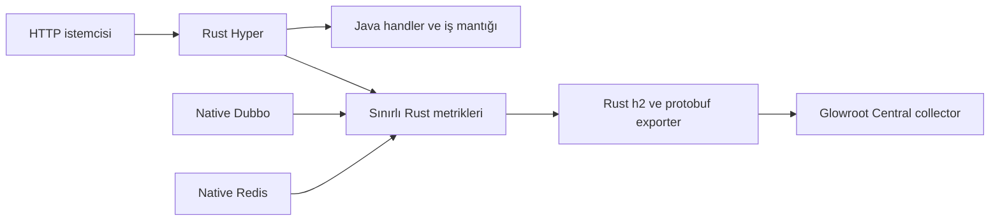

# Java-Rust Glowroot Mikro Ajan

[English](README.md) | [Türkçe](README.tr.md)

[](https://github.com/esasmer-dou/java-rust-glowroot-agent/actions/workflows/ci.yml)
[](https://github.com/esasmer-dou/java-rust-glowroot-agent/releases)

`java-rust-glowroot-agent`, Rust-Java REST uygulamasından topladığı sınırlı telemetriyi Glowroot
Central collector'a gönderir. Java handler, service, validation, veri tabanı erişimi ve iş mantığı
değişmez. Telemetriyi mevcut Rust native runtime toplar ve gönderir.

## Sürüm Durumu

`0.1.0-rc1`, isteğe bağlı bootstrap JAR'ının ilk release candidate sürümüdür. Native ABI `28`
kullanan uyumlu Rust-Java REST geliştirme runtime'ını gerektirir. Yayınlanmış Rust-Java REST `4.3.0`
runtime'ı ABI `26` kullanır ve bu telemetri yolunu açamaz.

JAR, telemetri engine'i değildir. Yalnızca `-javaagent` argümanlarını framework property'lerine
çevirir. En düşük resident memory için JAR eklemeyin. Uyumlu native runtime'ı property veya ortam
değişkenleriyle doğrudan yapılandırın.

## Deployment Sınırı

Mevcut Glowroot Central/collector aynen kalır. Bu proje yeni bir collector, veri tabanı veya UI
sağlamaz. Production ortamında yalnız Rust-Java uygulamalarında değişiklik yapılır:

| Çalışan parça | Ne değişir? |
| --- | --- |
| Mevcut Glowroot Central/collector | Hiçbir şey; mevcut deployment ve storage kullanılmaya devam eder |
| Rust-Java uygulaması | Telemetri framework property'leri veya ortam değişkenleriyle açılır |
| Rust-Java native runtime | `glowroot` özelliğini içeren uyumlu framework binary'si kullanılır |
| İsteğe bağlı kolaylık JAR'ı | `-javaagent` argümanlarını çevirir; sert bellek bütçeli production yoluna dahil değildir |
| Java handler ve service'ler | Hiçbir şey |
| Benchmark mock collector | Yalnız test içindir; production ortamına kurulmaz |

Sert bellek bütçeli production yolunda telemetri, Rust-Java framework'ün zaten yüklediği Rust
engine içinde doğrudan başlar. Java agent gerekmez. İsteğe bağlı JAR yalnız `-javaagent`
argümanlarını aynı framework property'lerine çevirir. Veriyi Rust engine toplar ve gönderir.

Bu proje, full Glowroot Java agent'ın küçültülmüş kopyası değildir. RSS ve request gecikmesi hassas
olan Rust-Java servisleri için hazırlanmış framework'e özel bir mikro ajandır.
Upstream analiz, hata davranışı, memory bütçesi ve bilinçli olarak desteklenmeyen alanlar için
[Mimari ve Production Sınırı](docs/ARCHITECTURE.tr.md) belgesine bakın.
Dosya bazlı upstream inceleme ve reddedilen alternatifler için
[Upstream Glowroot Analizi ve Tasarım Kararı](docs/UPSTREAM_ANALYSIS.tr.md) belgesini okuyun.
Tekrarlanabilir footprint, protokol ve performance gate kanıtları için
[Doğrulama Kanıtı](docs/VALIDATION.tr.md) belgesini okuyun.

## Buradan Başlayın

| İhtiyacınız | Kullanmanız gereken |
| --- | --- |
| Çok düşük ek yükle endpoint gecikmesi, trafik, hata, RSS ve thread sayısı | Bu mikro ajan |
| Native Dubbo ve native Redis çağrı süreleri | Bu mikro ajan |
| Herhangi bir Java metodunu izleme, JDBC SQL, JMX veya profiler | Full Glowroot agent |
| Pod ile collector arasında TLS veya mTLS | Bu ajanın önünde service-mesh veya localhost TLS sidecar |

## Çalışma Akışı



Production yolu Java agent veya class transformer kurmaz. İsteğe bağlı kolaylık JAR'ı tek bootstrap
class içerir ve runtime dependency taşımaz. Protobuf encode, HTTP/2, örnekleme, trace kuyruğu,
reconnect ve export işlemleri mevcut Rust native runtime içinde çalışır.

## Hangi Veriler Toplanır?

| Telemetri | Davranış |
| --- | --- |
| HTTP endpoint sayısı ve süresi | Sınırlı ağırlıklı örnekleme; endpoint adı build-time route tablosundan gelir |
| HTTP `5xx` sayısı | Tam sayılır; örnekleme hatayı saklamaz |
| Yavaş ve hatalı HTTP trace | Sınırlı kuyruk; request body, header, query değeri veya kişisel veri kopyalanmaz |
| Native Dubbo çağrısı | Toplam çağrı, süre ve hata |
| Native Redis read/write | Ayrı çağrı, süre ve hata toplamı |
| Process RSS ve thread sayısı | Her export aralığında bir kez okunur |
| Exporter sağlığı | Bağlantı, reconnect, hata ve drop sayaçları |

Mikro ajan; rastgele Java metodu, SQL metni, stack trace, log olayı, JMX attribute, thread profili
veya heap dump toplamaz. Bu özellikler bytecode instrumentation, ek class, queue ve kalıcı state
gerektirir. Bu yüzeyler hedeflenen bellek bütçesiyle uyumlu değildir.

## Beş Dakikada Kurulum

`glowroot` native özelliğini içeren uyumlu Rust-Java REST runtime'ı kullanın. `0.1.0-rc1` release
candidate sürümü REST native ABI `28` kullanır. Yayınlanmış `4.3.0` ABI `26` binary'si ile
karıştırmayın.

```powershell
java `
  -Dreactor.glowroot.enabled=true `
  -Dreactor.glowroot.collector.address=http://127.0.0.1:8181 `
  -Dreactor.glowroot.agent.id=catalog::local `
  -Dreactor.glowroot.application.name=catalog-api `
  -jar your-application.jar
```

Aynı değerleri `rust-spring.properties` dosyasına da yazabilirsiniz:

```properties
reactor.glowroot.enabled=true
reactor.glowroot.profile=micro
reactor.glowroot.collector.address=http://127.0.0.1:8181
reactor.glowroot.agent.id=catalog::local
reactor.glowroot.application.name=catalog-api
reactor.glowroot.http.sample-rate=256
reactor.glowroot.trace.slow-threshold-ms=500
reactor.glowroot.trace.capacity=0
reactor.glowroot.max-routes=64
reactor.glowroot.max-export-bytes=65536
```

Konfigürasyon önceliği şöyledir:

1. JVM `-Dreactor.glowroot...` property'leri.
2. Kolaylık JAR'ı kullanılırsa isteğe bağlı `-javaagent:...=key=value` argümanları.
3. `REACTOR_GLOWROOT_AGENT_ID` gibi ortam değişkenleri.
4. Dış `rust-spring.properties` dosyası.
5. Classpath varsayılanları.

Hatalı konfigürasyon uygulama başlangıcını durdurur. Konfigürasyon doğruysa collector'ın kapalı
olması HTTP trafiğini durdurmaz.

## İsteğe Bağlı Maven Paketi

Önerilen property veya ortam değişkeni yolunu kullanıyorsanız bu bölümü atlayın. Paket yalnızca
deployment standardınız `-javaagent` kullanmayı gerektiriyorsa faydalıdır.

Repository public olsa da GitHub Packages kimlik doğrulaması ister. `read:packages` yetkili bir
GitHub token oluşturun. Ardından `~/.m2/settings.xml` dosyasına ekleyin:

```xml
<settings>
  <servers>
    <server>
      <id>github</id>
      <username>GITHUB_KULLANICI_ADINIZ</username>
      <password>GITHUB_PACKAGES_TOKEN_DEGERINIZ</password>
    </server>
  </servers>
</settings>
```

GitHub Packages repository tanımını ve runtime kapsamındaki bootstrap dependency'sini POM'a ekleyin:

```xml
<repositories>
  <repository>
    <id>github</id>
    <url>https://maven.pkg.github.com/esasmer-dou/java-rust-glowroot-agent</url>
  </repository>
</repositories>

<dependencies>
  <dependency>
    <groupId>com.reactor</groupId>
    <artifactId>java-rust-glowroot-agent</artifactId>
    <version>0.1.0-rc1</version>
    <scope>runtime</scope>
  </dependency>
</dependencies>
```

Kolaylık bootstrap'ını kullanmak istediğinizde çözülmüş JAR ile uygulamayı başlatın:

```bash
java \
  -javaagent:$HOME/.m2/repository/com/reactor/java-rust-glowroot-agent/0.1.0-rc1/java-rust-glowroot-agent-0.1.0-rc1.jar=collector=glowroot-collector:8181,agent-id=catalog::pod-1 \
  -jar your-application.jar
```

Mevcut bir `-Dreactor.glowroot.*` property değeri, aynı `-javaagent` argümanından önceliklidir.
Böylece ortama özel değerleri image dışında tutabilirsiniz.

## Kubernetes Örneği

Her pod için farklı ve sabit bir agent id kullanın. Pod adı leaf id olarak kullanılabilir. `::` ile
biten prefix, Glowroot içinde rollup hiyerarşisi oluşturur.

Sert bellek bütçeli kullanımda image içine agent JAR eklemek gerekmez. Uyumlu native runtime'ı ortam
değişkenleriyle yapılandırın. Collector image veya deployment'ını değiştirmeyin:

```yaml
spec:
  template:
    spec:
      containers:
        - name: catalog-api
          image: registry.example/catalog-api:1.0.0
          env:
            - name: REACTOR_GLOWROOT_ENABLED
              value: "true"
            - name: REACTOR_GLOWROOT_COLLECTOR_ADDRESS
              value: "http://glowroot-collector.observability.svc.cluster.local:8181"
            - name: REACTOR_GLOWROOT_AGENT_ID
              valueFrom:
                fieldRef:
                  fieldPath: metadata.name
            - name: REACTOR_GLOWROOT_APPLICATION_NAME
              value: "catalog-api"
            - name: REACTOR_GLOWROOT_HTTP_SAMPLE_RATE
              value: "256"
            - name: REACTOR_GLOWROOT_TRACE_CAPACITY
              value: "0"
```

Native mikro transport düz HTTP/2 kullanır. Bu bağlantıyı güvenilen cluster network'ünde tutun.
Şifreleme veya istemci kimliği gerekiyorsa localhost sidecar kullanın. TLS veya mTLS bağlantısını
sidecar kursun. Düz collector portunu internete açmayın.

Sert bellek profili collector adını yalnız startup sırasında çözümler. En fazla dört farklı IP
adresini saklar. Normal bir Kubernetes `ClusterIP` Service veya localhost sidecar adresi kullanın.
Pod çalışırken endpoint IP'leri değişebilen headless Service kullanmayın. Collector DNS kaydı
değişirse pod'u yeniden başlatın. DNS hiç adres döndürmezse veya dört farklı adresten fazlasını
döndürürse uygulama başlamaz. Bu kural, uygulamaya dinamik DNS thread'i ve sınırsız adres listesi
eklenmesini önler.

## Örnekleme Değerini Seçin

`reactor.glowroot.http.sample-rate=N`, yaklaşık her `N` başarılı isteğin birini kaydeder ve `N`
ağırlığıyla raporlar. Değer `1` ile `1024` arasında ikinin kuvveti olmalıdır. HTTP hataları her zaman
tam sayılır.

| Trafik şekli | Başlangıç değeri | Trace kapasitesi | Neden? |
| --- | ---: | ---: | --- |
| Düşük trafik, kesin aggregate bilgisi önemli | `1` veya `8` | `0` | Trace tutmadan gecikme dağılımını daha ayrıntılı gösterir |
| Normal veya yüksek API trafiği | `256` | `0` | Güncel mikro profil varsayılanıdır; aggregate, hata, RSS, thread, Dubbo ve Redis telemetrisini sınırlı tutar |
| Staging ortamında daha ayrıntılı gecikme dağılımı | `64` veya `128` | `0` | Daha fazla başarılı istek route histogramını günceller; production öncesinde p99 ölçülmelidir |
| Tek staging podunda olay inceleme | `8` | `16` veya `32` | Sınırlı yavaş/hatalı trace ekler; önce p99 ve RSS A/B testi yapılmalıdır |

Dakikada birkaç çağrı alan endpoint'te dakika bazında kesin sayı gerekiyorsa büyük sample-rate
kullanmayın. O servis için `1` seçin veya ayrıca business metric üretin.
Varsayılan profil bilinçli olarak aggregate önceliklidir. `trace.capacity` değerini `0` üzerine
çıkarmak sınırlı trace state'i ayırır ve footprint sözleşmesini değiştirir. Bu nedenle trace'i
yalnızca bilinçli bir operasyon kararıyla açın.

## Property Referansı

| Property | Varsayılan | Sınır | Ne işe yarar? |
| --- | ---: | ---: | --- |
| `reactor.glowroot.enabled` | `false` | boolean | Native telemetri engine'ini açar |
| `reactor.glowroot.profile` | `micro` | yalnız `micro` | Sınırlı feature setini seçer |
| `reactor.glowroot.collector.address` | `http://127.0.0.1:8181` | en fazla 512 byte; startup'ta en fazla 4 IP | Düz h2 collector adresi; sabit `ClusterIP` veya localhost kullanın |
| `reactor.glowroot.agent.id` | boş | 1-256 byte | Zorunlu agent ve rollup kimliği |
| `reactor.glowroot.application.name` | `reactor.application.name` | 1-128 byte | Glowroot ekranındaki uygulama adı |
| `reactor.glowroot.hostname` | `HOSTNAME` | en fazla 255 byte | Host veya pod kimliği |
| `reactor.glowroot.export.interval-ms` | `60000` | 60000-3600000, 60000'in katı | Aggregate ve gauge gönderim aralığı |
| `reactor.glowroot.connect-timeout-ms` | `1000` | 100-30000 | TCP ve h2 bağlantı timeout'u |
| `reactor.glowroot.request-timeout-ms` | `2000` | 100-30000 | Tüm gRPC request yaşam süresi timeout'u |
| `reactor.glowroot.trace.slow-threshold-ms` | `500` | 1-3600000 | Yavaş request trace sınırı |
| `reactor.glowroot.http.sample-rate` | `256` | 1-1024, ikinin kuvveti | Başarılı HTTP aggregate örneklemesi; HTTP `5xx` tam sayılır |
| `reactor.glowroot.trace.capacity` | `0` | 0-32 | Sınırlı trace kuyruğu; `0` iken trace kuyruğu ayrılmaz |
| `reactor.glowroot.max-routes` | `64` | 1-64 | 1 MiB profilindeki en fazla HTTP route metric slotu |
| `reactor.glowroot.max-export-bytes` | `65536` | 16384-65536 | 1 MiB profilindeki tek collector request sınırı |

Her property'nin environment karşılığı vardır. Nokta ve tire yerine alt çizgi kullanın. Harfleri
büyük yazın. Örnek: `reactor.glowroot.max-export-bytes`,
`REACTOR_GLOWROOT_MAX_EXPORT_BYTES` olur.

## Hata ve Yük Davranışı

- Collector bağlantısı ve gRPC çağrıları timeout ile sınırlıdır.
- Reconnect, 250 ms ile 30 saniye arasında exponential backoff kullanır.
- HTTP request, collector'ı beklemez.
- Trace kuyruğu ve route tablosu hard limit taşır.
- Gönderilemeyen interval rollup sınırında bırakılır. Bellekte süresiz tutulmaz.
- Büyük collector mesajı local olarak reddedilir. Bellek büyütülmez.
- Glowroot'a gönderilen agent config read-only'dir. Remote config uygulanmaz.

Durumu log okumadan kontrol edin:

```bash
curl -s http://localhost:8080/diagnostics/glowroot
curl -s http://localhost:8080/metrics | grep reactor_glowroot
```

Özellikle `connected`, `collector_dns_mode`, `resolved_collector_addresses`, `export_failure`,
`dropped_intervals`, `dropped_transactions`, `dropped_traces`, `dropped_routes` ve `last_error_code`
alanlarını izleyin.

## Performance Gate

Ajana atfedilebilen bellek için uygulanabilir kesin sınır `1 MiB` değeridir. Rust başlangıç kontrolü,
hesaplanan state ve transport rezervi için en fazla `384 KiB` kabul eder. Native özellik sayfaları
ve allocator yerleşimi için `640 KiB` bırakır. Bu sınırı aşan ayar uygulamanın başlamasını engeller.
Sınırı artıran bir property yoktur. Bu sınır, OpenJ9 veya uygulamanın ajandan bağımsız belleğini
yönetmez.

Kaynak kod sınırı gereklidir, ancak tek başına toplam container belleğini kanıtlamaz. Container
`memory.current`; OpenJ9 JIT, GC, page cache, kernel socket belleği ve allocator yerleşimini de
kapsar. Bu nedenle release gate yalnız medyanı değil, gözlenen her maksimumu denetler. İyi görünen
medyan kesin maksimum diye sunulamaz. Aynı image'ı telemetri kapalı ve açık çalıştırın.
Linux process `VmRSS`, cgroup working set,
başarılı HTTP 200 RPS, p99 ve `503` oranını karşılaştırın. Her endpoint ve concurrency hücresi ayrı
geçmelidir. İyi görünen toplam medyan kararsız bir hücreyi gizleyemez.

```powershell
.\benchmark\glowroot_gate.ps1 `
  -PairRepeats 4 `
  -ConcurrencyLevels "64,256" `
  -EndpointClasses "small-json-direct,direct-json-writer,raw-json" `
  -Duration "20s" `
  -Warmup "8s" `
  -FailOnGate
```

Embedded production sınırı, eşleştirilmiş her process `VmRSS`, smaps RSS ve cgroup-current farkı
için en fazla `+3,00 MiB` ve ek thread için `0` değeridir. Bu konservatif artifact gate'i, daha sıkı
olan `1 MiB` agent-owned kaynak bütçesinden ayrıdır. Performance hücrelerinde en fazla `%2` başarılı
HTTP 200 RPS kaybı ve en fazla `%10` p99 artışı kabul edilir. Varyasyon yüksekse sonuç başarı değil
`INCONCLUSIVE` olur.

Release-grade script'ler yüke başlamadan önce Windows host'un sakin olmasını da zorunlu tutar.
Ortalama CPU en fazla `%15`, tepe CPU en fazla `%40` ve boş virtual memory en az `3072 MiB`
olmalıdır. Preflight başarısızsa bekleyin veya dedicated runner kullanın. Release kanıtında bu
kontrolü atlamayın.

Güncel exact-source attribution koşusu üç dengeli CPU-slot fazı kullandı. Her endpoint ve varyant tam
`4.096` istek aldı. Script, feature kapalı SO dosyasını oluşturmadan önce native kaynak ağacının
fingerprint değerini aldı ve eski build çıktısını reddetti. Embedded-native ayarın sınırlı state ve
rezerv toplamı `358.531` byte'tır. Ölçülen native özellik sayfaları eklendiğinde ajana atfedilen üst
sınır `0,694 MiB` olur. Ek thread sayısı `0` değeridir.

Deterministik agent-owned bütçe ve bağımsız proses resident gate'i **PASS** durumundadır.
Embedded-native medyan farkları `VmRSS +1,676 MiB`, smaps RSS `+1,711 MiB` ve cgroup current
`+0,461 MiB` oldu. En büyük eşleştirilmiş farklar `VmRSS +1,742 MiB`, smaps RSS `+1,817 MiB` ve
cgroup current `+1,754 MiB` oldu. Thread farkı `0` kaldı. Bu proses değerleri JVM ve allocator
oynaklığını da içerir. Bu nedenle `3 MiB` resident sınırının kanıtıdır; kaynak kodla sınırlanan
allocation sözleşmesinin yerine geçmez.

Release ile birlikte saklanan ölçüm kanıtları
[`docs/evidence/0.1.0-rc1`](docs/evidence/0.1.0-rc1/README.md) dizinindedir. Üretilen benchmark çalışma
dizinleri ignored kalır. Böylece ham loglar ve geçici container bilgileri runtime repository'sine
girmez.

İsteğe bağlı kolaylık JAR'ı sert bütçeli production yolu için sertifikalı değildir. Kaynakta
atfedilen üst sınırı `0,741 MiB` olsa da gözlenen process/smaps RSS maksimumu yaklaşık `3,055 MiB`
oldu. Resident memory sınırı kritikse native property veya ortam değişkeni yolunu kullanın.

Güncel varsayılan sample rate `256` ile hedefli c256 small-direct gate'i geçti. Başarılı HTTP 200
RPS farkı `-%0,17`, p99 farkı `+%6,28` ve `503` farkı sıfır oldu. Son workstation koşusunda host
gürültüsü preflight kontrolünü geçemediği için tam c64/c256 endpoint matrisi bilinçli olarak açıktır.
`INCONCLUSIVE` sonucu başarıya çevirmeyin.

```powershell
.\benchmark\feature_artifact_footprint.ps1 `
  -RepeatCount 3 `
  -Concurrency 256 `
  -RequestsPerEndpoint 4096 `
  -FailOnGate
```

Protokol uyumluluğu, collector kapalı fail-open davranışı, kaynak kodda uygulanan `1 MiB` bütçe ve
embedded-native `3 MiB` resident gate'i geçti. Hedefli c256 performance hücresi de geçti. Geniş bir
performance iddiası yayımlamadan önce tam endpoint matrisini hedef Kubernetes node sınıfında
çalıştırın. Agent-owned state için sert sınır uygulanabilir; container içindeki ilgisiz OpenJ9,
uygulama, page cache veya kernel belleği bu sınırla yönetilemez.

Bu aynı-image gate'i telemetriyi açmanın maliyetini ölçer. Release öncesinde son yayınlanan framework
image'ını, yeni framework ve açık ajan ile de karşılaştırın. Bu ikinci gate yeni native kod
sayfalarını da kapsar. Her iki tarafta zaten bulunan feature kodunun baseline içinde gizlenmesini önler.

Mock collector yalnız test içindir. Read-only upstream Glowroot checkout içindeki gerçek protobuf
şemasını derler. Init, aggregate, HdrHistogram, gauge ve trace mesajlarını doğrular. Mock'un gRPC,
protobuf, Netty ve HdrHistogram dependency'leri agent JAR'a veya uygulamaya girmez.
Production bileşeni değildir ve mevcut Glowroot collector'ın yerini almaz.

## Build ve Doğrulama

```powershell
mvn clean package
```

Runtime JAR içinde yalnız ince bootstrap class'ları ve metadata bulunmalıdır:

```powershell
jar tf target/java-rust-glowroot-agent-0.1.0-rc1.jar
```

Native değişiklik `rust-spring` içinde build edilir. DLL ve SO, `rust-java-rest` paketine provenance
manifestiyle senkronize edilir. İki platform aynı source revision'dan üretilmelidir.
Güncel geliştirme runtime'ı native ABI `28` kullanır. Agent, yayınlanmış ABI `26` runtime ile uyumlu
değildir.

## Uyumluluk Sınırı

Protokol, upstream Glowroot `622dc6f800228cccc6fa37b0ed9e779446d7c41e`
(`0.14.8-beta.5-SNAPSHOT`) wire contract'ıyla doğrulandı. Eski unary aggregate ve trace metotları bu
Central sürümünde hâlâ desteklenir. Central sürümünü değiştirmeden önce protokol gate'ini yeniden
çalıştırın. Test etmeden ileriye dönük uyumluluk varsaymayın.
