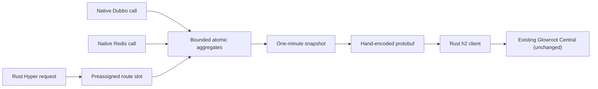

# Architecture And Production Boundary

[English](ARCHITECTURE.md) | [Turkish](ARCHITECTURE.tr.md)

## Decision

This project does not repackage or partially exclude dependencies from the full Glowroot Java
agent. It implements a separate framework-specific telemetry plane that speaks the Glowroot
collector wire contract.

The telemetry plane is application-side only. The existing Glowroot Central/collector deployment,
storage, and UI remain unchanged. The benchmark mock collector is validation infrastructure, not a
runtime component or a replacement collector.

The decision is deliberate. The upstream agent core uses Java instrumentation and retransformation,
ASM weaving, plugin discovery, Guava, Jackson, Logback, protobuf, gRPC, and Netty. Removing those
dependencies while preserving arbitrary Java method, JDBC, JMX, and profiler behavior would break
the full agent contract. Keeping them would make the `1 MiB` agent-owned budget impossible.

## Data Plane

- Java `premain` only establishes configuration. It installs no transformer.
- Route names are assigned once during startup. Request paths do not allocate metric names.
- Successful HTTP requests use weighted bounded sampling. HTTP `5xx` remains exact.
- Trace samples contain route name, status, and timing only. Request bodies, query values, headers,
  SQL, and business payloads are not copied.
- Route slots, trace capacity, encoded request size, h2 windows, timeouts, and reconnect backoff all
  have hard limits.
- Export uses the existing Tokio runtime. It creates no Java executor and no dedicated native OS
  thread.
- Minute snapshots remain lock-free. A request racing the exact rollup boundary can be accounted in
  the adjacent interval, so individual minute boundaries are approximate. This avoids a request-path
  lock; dashboards and alerts should use rolling windows instead of requiring exact boundary totals.

## Failure Contract

Collector failure must never fail an application request. The exporter uses connect and whole-call
timeouts plus bounded exponential reconnect backoff. When a rollup expires while disconnected, its
aggregates and traces are dropped and exposed through diagnostics. The agent does not build an
unbounded retry backlog.

Invalid local configuration is different: it fails startup before traffic. Examples are a missing
agent id, an unsupported TLS collector URL, a non-power-of-two sample rate, or limits above the
micro profile bounds.

## Memory Budget

`+1 MiB` is a hard agent-attributed product boundary, not a tuning suggestion. Startup admits at
most `384 KiB` for calculated state and transport reserves. It leaves `640 KiB` for native feature
pages and allocator residency. Startup fails if the calculated ceiling is too large. A property
cannot raise the limit. This contract does not cap unrelated JVM, application, or kernel memory.

| Surface | Design control |
| --- | --- |
| Java surface | Embedded-native production mode needs no agent; optional JAR has one class and no transformer |
| Route state | Fixed `max-routes`; atomics allocated once |
| Traces | Optional fixed `trace-capacity`; `0` removes the queue and slow-trace check |
| Network | Startup-only DNS capped at 4 IPs; one batch-scoped h2 connection with 16 KiB flow-control and socket-buffer requests |
| Encoding | At most `max-export-bytes`; no protobuf-java object graph |
| Threads | Reuses the framework Tokio runtime |
| Disconnected collector | Bounded backoff and interval drop, no retained backlog |

The public `micro` profile is deliberately capped at `64` route slots, `32` trace samples, and a
`64 KiB` encoded request. The default keeps trace capacity at `0`. Export snapshots and protobuf
buffers allocate their calculated final capacity once instead of growing geometrically.

Linux release evidence separates two boundaries. Agent-owned state plus measured feature pages must
remain below the deterministic `1 MiB` source budget. Every observed feature-enabled versus
feature-disabled paired delta for process `VmRSS`, smaps RSS, and cgroup current must remain at or
below the conservative `3 MiB` resident boundary, with no additional thread. Independent OpenJ9
processes can differ because JIT, GC, allocator, and page residency are not deterministic. The
resident gate intentionally includes this noise; it does not replace the source allocation contract.
Each important endpoint and concurrency cell must also stay within `-2%` RPS and `+10%` p99 gates.
An unstable run is `INCONCLUSIVE`.

Release evidence also compares the previous published framework with the new framework plus the
enabled agent. This second comparison includes native code-page growth that a same-image on/off
comparison cannot expose.

The exact-source embedded-native artifact has an attributed ceiling of `0.694 MiB` and `0`
additional threads. Its latest three-phase resident gate also passes: maximum deltas were
`VmRSS +1.742 MiB`, smaps RSS `+1.817 MiB`, and cgroup current `+1.754 MiB`. The gate fingerprints all
native source inputs before accepting a cached feature-disabled SO, so stale baseline binaries are
rejected. The optional convenience JAR is reported separately and is not certified for the strict
resident path; its observed process/smaps maximum reached about `3.055 MiB`.

The exporter resolves collector DNS synchronously during startup and stores at most four unique IP
addresses. Reconnects use only that immutable set, so no runtime DNS worker or growing resolver state
is introduced. The hard-memory profile therefore requires a normal Kubernetes `ClusterIP` Service
or localhost sidecar. Headless or dynamically changing DNS requires a pod restart and is outside this
profile's contract.

## Spring Boot Boundary

Spring Boot Servlet MVC uses two deliberately separate artifacts. The bootstrap JAR contains one
premain class and only maps bounded arguments to properties. The starter stays in Spring Boot's
application classloader, registers one MVC interceptor, and owns the standalone native binary. This
split avoids the parent/child classloader failure caused by putting Spring MVC classes in a
`-javaagent` JAR used with an executable Spring Boot archive.

Successful requests are sampled in Java before JNI. Mapped MVC handler `5xx` responses remain exact.
The interceptor resolves Spring's normalized route pattern after dispatch only for a sampled, slow,
or failed request. An unsampled successful request allocates no agent request object. Sampled or
trace-enabled requests retain one small observation on the request; async redispatch reuses Spring
MVC's existing completion lifecycle. The adapter creates no Java executor, Servlet filter, or
classpath scan. The standalone Rust library runs one current-thread
Tokio exporter on a `256 KiB` stack. Every queue, route table, trace buffer, message, and DNS address
set is bounded by the same native engine contract.

The adapter does not use bytecode weaving, Byte Buddy/ASM, Java gRPC/Netty, or a general-purpose
event bus. Version `0.2.1` supports Servlet MVC, not WebFlux. Use the full Glowroot agent when
Spring-specific method, JDBC, JMX, or profiler instrumentation is required.

The certified low-memory Spring path activates the starter with properties or environment
variables. The optional one-class `-javaagent` bootstrap remains supported for early startup
metadata and operational conventions, but its OpenJ9 instrumentation bootstrap is measured and
reported separately even though it installs no transformer.

## Compatibility

The test collector compiles the protobuf schema directly from the read-only upstream Glowroot
checkout and parses the Rust messages with generated protobuf classes. The reference revision is
`622dc6f800228cccc6fa37b0ed9e779446d7c41e`. Re-run this protocol gate for every Glowroot Central
upgrade. The current implementation uses collector-compatible legacy unary aggregate and trace
methods; it does not assume that deprecated methods will remain forever.

## Deliberately Unsupported

- arbitrary method or library instrumentation;
- JDBC SQL text and query trace capture;
- JMX attribute discovery;
- log-event capture;
- thread or allocation profiling;
- heap dumps;
- live bytecode weaving or remote agent configuration;
- direct TLS/mTLS transport in v1.

Use the full Glowroot Java agent for those requirements. For TLS/mTLS with the micro agent, use a
localhost sidecar or service mesh and keep the native h2 hop inside the pod.
