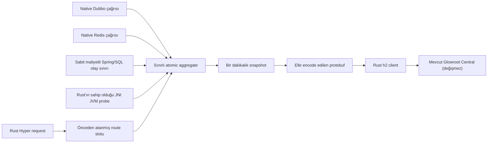

# Mimari ve Production Sınırı

[English](ARCHITECTURE.md) | [Türkçe](ARCHITECTURE.tr.md)

## Karar

Bu proje, tam Glowroot Java agent içinden bazı dependency'leri çıkararak yeni bir JAR üretmez.
Glowroot collector wire kontratına konuşan, framework'e özel ayrı bir telemetri plane oluşturur.

Telemetri plane yalnız application tarafındadır. Mevcut Glowroot Central/collector deployment'ı,
storage ve UI değişmez. Benchmark mock collector yalnız doğrulama altyapısıdır. Runtime bileşeni
veya mevcut collector'ın alternatifi değildir.

Bu bilinçli bir karardır. Upstream agent core; Java instrumentation ve retransform, ASM weaving,
plugin discovery, Guava, Jackson, Logback, protobuf, gRPC ve Netty kullanır. Bu dependency'leri
çıkarıp herhangi bir Java metodu, JDBC, JMX ve profiler desteğini korumak mümkün değildir. Hepsini
tutmak ise `1 MiB` agent-owned bütçe hedefiyle bağdaşmaz.

## Veri Akışı

- Java `premain` yalnız konfigürasyonu hazırlar. Transformer kurmaz.
- Route adları startup sırasında bir kez atanır. Request path'i metric adı oluşturmaz.
- Tamamlanan her HTTP isteği, sınırlı endpoint toplamını tam olarak günceller. Örnekleme yalnız
  isteğe bağlı trace ayrıntısına uygulanır; Average, Percentile, Throughput ve hata toplamını değiştirmez.
- HTTP trace yalnız route adı, status ve süre taşır. Request body, query değeri, header, bind değeri
  ve business payload kopyalanmaz. Açıkça tanımlanan SQL slotunda yalnız normalize edilmiş ve
  sınırlanmış statement etiketi tutulur.
- Route slotu, trace kapasitesi, encode request boyutu, h2 window, timeout ve reconnect backoff için
  kesin üst sınırlar vardır.
- Export ve profil kaynak iadesi, `256 KiB` stack kullanan tek ve izole current-thread Tokio runtime
  üzerinde çalışır. Hyper worker'larını veya uygulama executor'larını paylaşmaz.
- Aynı Rust thread; JVM bean discovery, JNI global referansları, periyodik heap/non-heap/pool/GC
  ölçümü, tanılama komutları ve tanılama dosya işlemlerini sahiplenir. Java tarafında JMX polling
  worker'ı, bean cache'i, snapshot buffer'ı veya tanılama yardımcı sınıfı yoktur.
- Dakikalık snapshot kilit kullanmaz. Tam rollup sınırında yarışan bir request komşu interval içinde
  sayılabilir. Bu nedenle tek bir dakikanın sınırı yaklaşık kabul edilir. Request path'ine kilit
  eklenmez; dashboard ve alarm kuralları tam sınır toplamı yerine kayan zaman aralığı kullanmalıdır.

## Hata Davranışı

Collector hatası hiçbir application request'ini düşürmemelidir. Exporter; bağlantı ve tüm çağrı için
timeout kullanır. Reconnect sınırlı exponential backoff ile yapılır. Collector kapalıyken bir rollup
süresi dolarsa aggregate ve trace verisi drop edilir. Bu durum diagnostics içinde görünür. Ajan
sınırsız retry backlog oluşturmaz.

Hatalı lokal konfigürasyon farklıdır. Trafik başlamadan startup'ı durdurur. Boş agent id, desteklenmeyen
TLS collector URL'i, ikinin kuvveti olmayan sample rate veya mikro profil sınırını aşan değer buna
örnektir.

## Memory Bütçesi

`+1 MiB`, ayar önerisi değil ajana atfedilen bellek için kesin ürün sınırıdır. Başlangıç kontrolü,
hesaplanan state ve transport rezervi için en fazla `448 KiB` kabul eder. Native özellik sayfaları
ve allocator yerleşimi için `576 KiB` bırakır. Hesaplanan üst sınır aşılırsa uygulama başlamaz.
Sınır property ile artırılamaz. Bu sözleşme JVM, uygulama veya kernel'in ajandan bağımsız belleğini
sınırlamaz. Hata bütçesi yalnız mesaj byte'larını saymaz. Frame yapıları, boxed frame dizisi, UTF-8
içerik ve tutulan her String için konservatif allocator metadata'sı da hesaba katılır.

| Yüzey | Kontrol |
| --- | --- |
| Java yüzeyi | Embedded-native production modunda agent yoktur; isteğe bağlı JAR tek class içerir ve transformer kurmaz |
| Route state | Sabit `max-routes`; atomikler bir kez ayrılır |
| Trace | İsteğe bağlı sabit `trace-capacity`; `0` kuyruk ve yavaş-trace kontrolünü kaldırır |
| Ağ | Startup'ta en fazla 4 IP çözümlenir; yalnız export batch'i boyunca açık kalan, 16 KiB flow-control ve socket-buffer isteği kullanan h2 bağlantısı |
| Encode | En fazla `max-export-bytes`; protobuf-java object graph yok |
| Thread | Tek izole current-thread Tokio exporter kullanılır; Hyper veya Java executor paylaşılmaz |
| Dinamik profil state'i | SQL slotları, hata kuyruğu, tanılama kuyruğu ve Rust'ın sahip olduğu JNI MXBean global referansları yalnız ilgili profil açıkken bulunur |
| Collector kapalı | Sınırlı backoff ve interval drop; biriken backlog yok |

Public `micro` profili en fazla `64` route slotu, `32` trace örneği ve `64 KiB` encode request kabul
eder. Varsayılan trace kapasitesi `0` değeridir. Export snapshot ve protobuf buffer'ları geometrik
büyümez. Hesaplanan son kapasiteyle bir kez ayrılır.

Linux release kanıtı iki ayrı sınırı kullanır. Agent-owned state ve ölçülen feature sayfaları,
deterministik `1 MiB` kaynak bütçesinin altında kalmalıdır. Feature açık ve kapalı prosesler arasında
gözlenen her eşleştirilmiş process `VmRSS`, smaps RSS ve cgroup current farkı konservatif `3 MiB`
resident sınırının altında kalmalıdır. `micro` için ek agent thread sayısı en fazla `1` olabilir. Bağımsız OpenJ9 prosesleri JIT,
GC, allocator ve resident sayfa farkı nedeniyle oynayabilir. Resident gate bu oynaklığı bilinçli
olarak kapsar; kaynak allocation sözleşmesinin yerine geçmez. Her önemli endpoint ve concurrency
hücresi ayrıca en fazla `%2` RPS kaybı ve `%10` p99 artışı sınırını geçmelidir. Kararsız koşu
`INCONCLUSIVE` sayılır.

Linux binary uyumluluğu ayrı bir release kuralıdır. Yayınlanan x64 `.so` dosyaları sabit
`glibc 2.17` sembol sınırıyla link edilir. `readelf` ile kontrol edilir ve Debian Stretch ile
Bookworm üzerinde yüklenir. GitHub runner'ın güncel GLIBC sürümü release uyumluluk sınırı olamaz.

Release kanıtında son yayınlanan framework ile yeni framework ve açık ajan ayrıca karşılaştırılır.
Bu ikinci karşılaştırma, aynı-image açma/kapatma testinin gösteremediği native kod sayfası büyümesini
de ölçer.

Yayınlanmış `0.2.1` exact-source embedded-native artifact için, exporter izolasyonundan önce atfedilen
üst sınır `0,694 MiB`, ek thread sayısı `0` oldu. Üç fazlı resident gate de geçti. Maksimum farklar `VmRSS +1,742 MiB`, smaps RSS
`+1,817 MiB` ve cgroup current `+1,754 MiB` oldu. Gate, cache içindeki feature kapalı SO dosyasını
kabul etmeden önce tüm native kaynak girdilerinin fingerprint değerini doğrular. Eski baseline
binary'si reddedilir. İsteğe bağlı kolaylık JAR'ı ayrı raporlanır ve strict resident yoluna dahil
değildir; gözlenen process/smaps maksimumu yaklaşık `3,055 MiB` olmuştur.

Exporter collector DNS kaydını startup sırasında senkron olarak çözümler. En fazla dört farklı IP
adresini değişmez bir listede saklar. Reconnect sırasında yalnız bu liste kullanılır. Böylece runtime
DNS worker'ı veya büyüyen resolver state oluşmaz. Sert bellek profili normal Kubernetes `ClusterIP`
Service veya localhost sidecar gerektirir. Headless ya da çalışma sırasında değişen DNS kaydı için
pod yeniden başlatılmalıdır; bu kullanım profil sözleşmesinin dışındadır.

## Spring Boot Sınırı

Spring Boot desteğinde web'den bağımsız native çekirdek ve açık framework sınırları vardır. Çekirdek,
process-scoped `NativeTelemetry` yaşam döngüsünü ve standalone native binary'yi yönetir. Web koşulu
yoktur. Bu nedenle veritabanı worker'ında, Kafka uygulamasında, scheduler'da, batch işinde ve komut
satırı servisinde çalışır. Desteklenen her Servlet motoru en düşük maliyetli tamamlanma noktasını
kullanır: Tomcat context Valve, Jetty RequestLog veya Undertow exchange completion listener. Reaktif
HTTP desteği ayrı WebFlux artifact'ında bulunur ve sınırlı tek `WebFilter` kullanır.

Paketleme; bootstrap, native runtime, taşınabilir MVC fallback ve sunucu adaptörlerini ayırır. Servlet
MVC kullanan kullanıcı yine tek ana starter ekler. İç adaptör JAR'larındaki sunucu API'leri `provided`
ve `optional` olarak tanımlıdır. Bu nedenle agent uygulamaya motor getirmez. Yalnız sınıfı ve server
factory'si zaten bulunan adaptör açılır. WebFlux artifact'ı yalnız reaktif uygulamaya eklenir. Bu
ayrım, Spring sınıfları executable Spring Boot JAR ile kullanılan `-javaagent` JAR içine konulduğunda
oluşan parent/child classloader hatasını önler. Ayrıca Servlet uygulamasına WebFlux veya seçilmeyen
bir sunucu motoru gelmez. CI üç ayrı MVC uygulaması ile Reactor Netty WebFlux uygulaması üretir;
seçilmeyen bir motor arşive girerse build durur.

Tamamlanan her istek, sabit maliyetli Java-Rust sınırı üzerinden bir endpoint toplamını tam olarak
günceller. Glowroot Central içindeki summary, overview, histogram ve throughput tablolarının doğru
oluşması için bu gereklidir. İsteğe bağlı trace örneklemesine Java tarafında karar verilir; ancak bu
karar istekleri endpoint toplamından çıkarmaz. Hatalar, asenkron tamamlanmalar ve bulunamayan istekler
bütün desteklenen motorlarda aynı sözleşmeyi kullanır. WebFlux filter, uygulama terminal sinyalini
ilettikten sonra reaktif tamamlanma noktasında telemetriyi kaydeder. Böylece exporter işi yanıt
üretimine girmez. Hiçbir adaptör Java executor, Servlet filter, request wrapper veya classpath
taraması oluşturmaz. Standalone Rust kütüphanesi, `256 KiB`
stack kullanan tek current-thread Tokio exporter çalıştırır. Queue, endpoint tablosu, trace buffer,
mesaj ve DNS adres listesi native engine'in sert sınırlarına uyar.

Transaction type, upstream Glowroot ile uyumlu olarak `Web` değeridir. Transaction adı HTTP metodunu
değil, yalnız normalize edilmiş endpoint'i taşır. Örneğin `/orders/{id}`, ekranda `/orders/*` olur.
Endpoint çeşitliliği sınırı aşılırsa isteklerin kaybolmaması için `max-routes` içindeki bir slot
`<route-limit-exceeded>` toplamına ayrılır.

Spring sınırı son eşleşen route'u, response status bilgisini, tamamlanmayı ve gerekirse `Throwable`
referansını okur. Bu bilgiler ancak framework dispatch tamamlandıktan sonra oluşur.
Adaptör toplama, encode, ağ, JMX polling veya dosya işlemi yapmaz. Bu sabit maliyetli sınırı Rust
başlangıç çağrısına çevirmek her request'e yeni JNI maliyeti ekler. JVMTI weaving ise tam agent
footprint'ini geri getirir. Hot-path sözleşmesi nedeniyle iki seçenek de kullanılmaz.

Hata ayrıntısının sahibi de Rust'tır. Aktif profil hata trace'i istiyorsa uygulama thread'i yalnız
zayıf bir JNI referansı oluşturur ve sınırlı native kuyruğa bırakır. İzole exporter bu referansı
güvenli biçimde açar, sınırlı JNI local frame oluşturur ve exception sınıfını, mesajını ve ayarlanan
sayıda stack satırını okur. Bekleyen referanslar ile hazırlanmış trace'ler aynı sert
`error_trace_capacity` sınırını paylaşır. İki kuyruk ayrı ayrı tam kapasite kullanamaz. Referans
okunmadan önce GC tarafından temizlenirse veya backpressure nedeniyle kabul edilmezse drop sayacı
artar. Uygulama yanıtı değişmez. Zayıf referans bilinçli bir seçimdir; isteğe bağlı trace için
büyük bir Java exception nesne grafiği bellekte tutulmaz.

Adaptörler bytecode weaving, Byte Buddy/ASM, Java gRPC/Netty veya genel event bus kullanmaz. Reactor
Netty'yi agent değil, WebFlux uygulaması sağlar. Spring'e özel method, JDBC, JMX veya profiler
instrumentation gerekiyorsa tam Glowroot agent kullanın. Sınırlı profiller yalnız açık SQL slotu,
seçilmiş JVM bellek/GC ölçümü, sınırlı hata stack bilgisi ve yetkili tanılama işlemi ekler.

MVC olmadığında aynı native exporter process RSS/thread ölçümlerini ve gönderim sağlığını toplamaya
devam eder. `jvm` profili JVM bellek/GC ölçümlerini ekler. `sql` ve `full`, tekrar kullanılan açık SQL
statement olaylarını kabul eder. `diagnostic`, sınırlı ve yetkili dump komutlarını kabul eder.
`0.4.0` Kafka kaydı veya scheduler job adını kendiliğinden bulmaz ve metotları weave etmez. Bu sınır
bilinçlidir. Otomatik ve genel metot instrumentation; transformer, class metadata, allocation ve Java
agent maliyetini yeniden getirir.

## Dinamik Profil Yaşam Döngüsü

Profil değişiklikleri Rust tarafında sıraya alınır. Aktif state değiştirilmeden önce eski profil yeni
iş kabul etmeyi bırakır. Eski state tek bir retired alana taşınır. İzole kontrol akışı son referansın
bırakıldığını görüp state'i drop etmeden ve ilgili transition kimliğini onaylamadan ikinci state
değişikliği kabul edilmez. Sınırsız retired-state listesi oluşmaz.

Exporter, SQL toplamı veya ayrıntılı hata verisi collector'a gönderilirken aynı nesil korumasını
tutar. Bu nedenle collector isteği profile ait etiketleri veya ayrıntı byte'larını kullanmaya devam
ederken kaynak bırakma işlemi tamamlanmış sayılmaz. İstek, tanımlı collector zaman aşımıyla sınırlıdır.
Kontrol çağrısı belleğin erken bırakıldığını söylemek yerine zaman aşımı hatası verir.

Profil düşürülürken kuyrukta kalan hata ve tanılama kayıtları sayaçla birlikte atılır. Eski SQL
generation kimlikleri etkisiz hale gelir. Rust, profile ait MXBean `GlobalRef` değerlerini drop eder.
Java bean listesi veya profile ait bridge callback'i yoktur. Linux glibc ortamında son referans bırakıldıktan sonra
`malloc_trim(0)` yalnız izole agent thread'i üzerinde çalışır. Windows bütün process'in working set'ini
zorla boşaltmaz; allocator sahipliği bırakılır ve OS iadesi daha sonra gerçekleşir.

Yakalanmayan REST handler hataları tek bir sabit native `Java Error` kimliği kullanır. Önce zayıf
bekleyen referans, ardından çıkarılan exception sınıfı, mesajı ve stack satırları ortak sınırlı profil
kuyruğunda yaşar. Yeni exception sınıfları kalıcı route slotu tüketmez ve `micro` profiline
dönüldüğünde etiket metni bırakmaz.

`malloc_trim(0)` Hyper worker'ları dışında çalışır; ancak glibc trim işlemi process genelindedir. Bu
işlem yalnız seyrek bir kontrol düzlemi adımıdır. Her request sırasında çağrılmamalıdır. Profil
değişiminden sonraki düşük RSS, agent dışındaki boş allocator sayfalarını da içerebilir. Bu değer tek
başına agent'a ait bellek kazancı olarak yorumlanmamalıdır.

OpenJ9 system classloader metadata'sı, JIT kodu ve ilk JVM yönetim çağrısında açılan `Finalizer
thread` uygulama kütüphanesi tarafından unload edilemez. Bunlar tek seferlik JVM ısınma state'i olarak
değerlendirilir ve tekrarlanan profil döngüsünde büyümeme gate'inden geçmelidir. Native profile ait
tutulmuş state olarak raporlanmaz.

Sertifikalı düşük bellekli Spring yolu, starter'ı property veya ortam değişkeniyle açar. Tek sınıflı
isteğe bağlı `-javaagent` bootstrap, erken startup bilgisi ve operasyon standardı için desteklenir.
Ancak transformer kurmasa bile OpenJ9 instrumentation sistemini başlattığı için bellek sonucu ayrı
ölçülür ve raporlanır.

## Uyumluluk

Test collector, protobuf şemasını read-only upstream Glowroot checkout'tan doğrudan derler. Rust
mesajlarını generated protobuf class'larıyla okur. Referans revision
`622dc6f800228cccc6fa37b0ed9e779446d7c41e` değeridir. Her Glowroot Central güncellemesinde protokol
gate'ini yeniden çalıştırın. Mevcut sürüm collector ile uyumlu eski unary aggregate ve trace
metotlarını kullanır. Deprecated metotların sonsuza kadar kalacağı varsayılmaz.

## Bilinçli Olarak Desteklenmeyen Alanlar

- herhangi bir Java metodu veya library instrumentation;
- otomatik JDBC proxy, bind değeri ve rastgele query trace;
- seçilmiş JVM bellek/GC ölçümleri dışındaki JMX attribute discovery;
- log event toplama;
- thread veya allocation profiler;
- yetkili yerel tanılama komutu olmadan zamanlanmış veya uzaktan başlatılan dump;
- canlı bytecode weaving veya remote agent konfigürasyonu;
- v1 içinde doğrudan TLS/mTLS transport.

Bu ihtiyaçlarda tam Glowroot Java agent'ı kullanın. Mikro ajanla TLS/mTLS gerekiyorsa localhost
sidecar veya service mesh kullanın. Native h2 bağlantısını pod içinde tutun.
