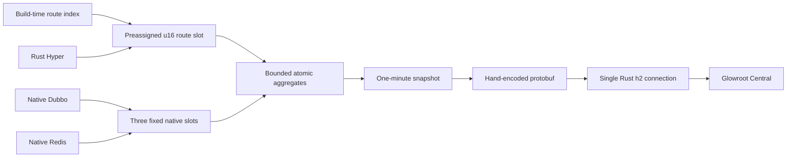

# Upstream Glowroot Analysis And Design Decision

[English](UPSTREAM_ANALYSIS.md) | [Turkish](UPSTREAM_ANALYSIS.tr.md)

## Scope

The reference checkout is the unmodified Glowroot revision
`622dc6f800228cccc6fa37b0ed9e779446d7c41e`. It is an input to this analysis and to the
benchmark-only protobuf compiler. `java-rust-glowroot-agent` does not fork, shade, or modify that
checkout.

The production collector is also not forked or replaced. Only the application agent and the
coordinated Rust-Java native runtime are delivered by this project.

The target is narrower than the full Glowroot agent:

- keep Java handlers and business logic unchanged;
- expose HTTP, native Dubbo, native Redis, RSS, thread, and exporter-health telemetry in Glowroot;
- add no Java request filter to Rust-Java REST and only one bounded Servlet filter to Spring MVC;
- keep all state, queues, payloads, and reconnect behavior bounded;
- keep agent-owned state and feature pages below `1 MiB`, and accept the embedded path only when
  every paired Linux resident-memory delta stays at or below `+3.00 MiB` with no new thread.

## What The Full Agent Owns

The upstream agent is a general-purpose APM runtime. Its broader cost follows from its broader
contract, not from one removable dependency.

| Upstream surface | Code evidence | Runtime implication |
| --- | --- | --- |
| Java agent startup | `agent/core/.../AgentPremain.java`, `MainEntryPoint.java` | Receives `Instrumentation`, inspects loaded classes, and initializes the agent runtime |
| Bytecode weaving | `agent/core/.../init/AgentModule.java`, `weaving/WeavingClassFileTransformer.java` | Transformers, ASM metadata, advice, class caches, and retransformation state |
| Plugin discovery | `agent/core/.../config/PluginCache.java` | Plugin descriptors, aspects, class names, and configuration stay available at runtime |
| Transaction and trace model | `agent/core/.../impl/Transaction.java`, `TraceCollector.java` | Per-transaction objects, entries, queries, stack/profile state, and a dedicated collector loop |
| JVM/JMX surface | `agent/core/.../init/GaugeCollector.java`, `live/LiveJvmServiceImpl.java` | MBean discovery, scheduled collection, JVM operations, and related metadata |
| Live operations | `live/LiveWeavingServiceImpl.java`, `central/DownstreamServiceObserver.java` | Bidirectional control, live weaving, thread/JVM requests, and configuration updates |
| Collector transport | `agent/core/.../central/CentralConnection.java` | Java gRPC and Netty channel, buffers, event-loop state, and reconnect machinery |
| Java dependencies | `agent/core/pom.xml` | ASM, Guava, Jackson, Logback, protobuf/wire API, gRPC, and Netty surfaces |

These components are valid for a full APM product. Removing them while promising arbitrary method
tracing, SQL capture, JMX, profiling, and live weaving would produce a fragile partial agent. Keeping
them cannot meet the micro-agent memory target.

## Rejected Designs

### ANTI-PATTERN: Shade the full agent and exclude JARs

Transitive exclusions reduce artifact size but do not define a valid runtime boundary. Glowroot's
core directly uses weaving, plugin, config, logging, protobuf, gRPC, and Netty types. Blind excludes
move the failure from build time to startup or an uncommon production path.

### ANTI-PATTERN: Install a small transformer for framework annotations

The framework already has a build-time route index and an immutable Rust route table. A transformer
would duplicate known metadata, load `java.instrument`, retain class-level state, and add class-load
risk without improving request telemetry.

### ACCEPTABLE: Full Glowroot agent for diagnostic pods

Use upstream Glowroot when method-level traces, JDBC SQL, JMX, stack traces, or profiling are required.
Run it with a separately measured pod budget. It is a different operational profile, not a fallback
inside the micro agent.

### BEST FOR THIS FRAMEWORK: Collector-compatible Rust telemetry plane

Use compile-time route knowledge and native data-plane hooks. Keep the Java JAR as a one-class
configuration bootstrap. Encode only the required public protobuf fields and send them through one
bounded Rust h2 connection.

## Implemented Runtime

The request path uses a preassigned `u16` slot. It does not create a transaction name, map key,
protobuf object, trace object, or Java callback. Successful HTTP requests use deterministic weighted
sampling. `5xx` errors stay exact. With `trace.capacity=0`, no trace queue is allocated and no slow
trace path is evaluated.

The exporter reuses the framework Tokio runtime. It creates tasks, not a dedicated operating-system
thread. The route table, trace queue, h2 windows, response body, encoded request, timeouts, and
reconnect delay all have hard limits. A disconnected collector never creates a retry backlog; the
expired interval is dropped and counted.

## Collector Contract

The micro agent sends these existing unary messages:

| Glowroot method | Data sent |
| --- | --- |
| `collectInit` | Agent id, host/process/Java identity, read-only config |
| `collectAggregates` | HTTP, Dubbo, and Redis counts, errors, duration, and HdrHistogram |
| `collectGaugeValues` | Process RSS, thread count, and exporter health |
| `collectTrace` | Optional bounded HTTP slow/error samples |

The unary aggregate and trace methods are marked deprecated in the current schema but remain part of
the tested contract. Every Central upgrade must rerun the generated-protobuf protocol gate. Migration
to the streaming methods is a future compatibility task, not an assumption hidden in v1.

## Production Boundary

The micro agent deliberately does not provide arbitrary method instrumentation, JDBC query capture,
JMX discovery, log capture, profiling, heap dumps, stack traces, live weaving, or remote agent
configuration. It currently supports plaintext h2 only. Use a localhost mTLS sidecar or service mesh
when the collector hop needs encryption or workload identity.

This boundary is the feature that protects the footprint. Adding one of the omitted surfaces requires
a separate architecture and a new RSS/RPS/p99 gate; it must not be silently added to the micro profile.
