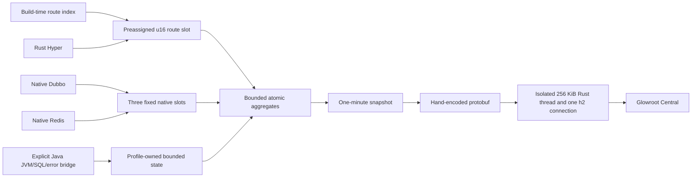

# Upstream Glowroot Analysis And Design Decision

[English](UPSTREAM_ANALYSIS.md) | [Turkish](UPSTREAM_ANALYSIS.tr.md)

## Scope

The reference checkout is the unmodified Glowroot revision
`622dc6f800228cccc6fa37b0ed9e779446d7c41e`. It is an input to this analysis and to the
benchmark-only protobuf compiler. `java-rust-glowroot-agent` does not fork, shade, or modify that
checkout.

The production collector is also not forked or replaced. Only the application agent and the
coordinated Rust-Java native runtime are delivered by this project.

The target is narrower than the full Glowroot agent:

- keep Java handlers and business logic unchanged;
- expose HTTP, native Dubbo, native Redis, RSS, thread, and exporter-health telemetry in Glowroot;
- add JVM/GC gauges, explicit SQL timings, bounded error stacks, and diagnostic commands only through
  temporary runtime profiles;
- add no Java request filter to Rust-Java REST; use the Tomcat context-valve fast path in Spring Boot
  and only one bounded MVC interceptor fallback on other Servlet containers;
- keep all state, queues, payloads, and reconnect behavior bounded;
- keep agent-owned state and feature pages below `1 MiB`, and isolate all exporter/profile-release
  work on one bounded native thread that never consumes Hyper or application workers.

## What The Full Agent Owns

The upstream agent is a general-purpose APM runtime. Its broader cost follows from its broader
contract, not from one removable dependency.

| Upstream surface | Code evidence | Runtime implication |
| --- | --- | --- |
| Java agent startup | `agent/core/.../AgentPremain.java`, `MainEntryPoint.java` | Receives `Instrumentation`, inspects loaded classes, and initializes the agent runtime |
| Bytecode weaving | `agent/core/.../init/AgentModule.java`, `weaving/WeavingClassFileTransformer.java` | Transformers, ASM metadata, advice, class caches, and retransformation state |
| Plugin discovery | `agent/core/.../config/PluginCache.java` | Plugin descriptors, aspects, class names, and configuration stay available at runtime |
| Transaction and trace model | `agent/core/.../impl/Transaction.java`, `TraceCollector.java` | Per-transaction objects, entries, queries, stack/profile state, and a dedicated collector loop |
| JVM/JMX surface | `agent/core/.../init/GaugeCollector.java`, `live/LiveJvmServiceImpl.java` | MBean discovery, scheduled collection, JVM operations, and related metadata |
| Live operations | `live/LiveWeavingServiceImpl.java`, `central/DownstreamServiceObserver.java` | Bidirectional control, live weaving, thread/JVM requests, and configuration updates |
| Collector transport | `agent/core/.../central/CentralConnection.java` | Java gRPC and Netty channel, buffers, event-loop state, and reconnect machinery |
| Java dependencies | `agent/core/pom.xml` | ASM, Guava, Jackson, Logback, protobuf/wire API, gRPC, and Netty surfaces |

These components are valid for a full APM product. Removing them while promising arbitrary method
tracing, SQL capture, JMX, profiling, and live weaving would produce a fragile partial agent. Keeping
them cannot meet the micro-agent memory target.

## Rejected Designs

### ANTI-PATTERN: Shade the full agent and exclude JARs

Transitive exclusions reduce artifact size but do not define a valid runtime boundary. Glowroot's
core directly uses weaving, plugin, config, logging, protobuf, gRPC, and Netty types. Blind excludes
move the failure from build time to startup or an uncommon production path.

### ANTI-PATTERN: Install a small transformer for framework annotations

The framework already has a build-time route index and an immutable Rust route table. A transformer
would duplicate known metadata, load `java.instrument`, retain class-level state, and add class-load
risk without improving request telemetry.

### ACCEPTABLE: Full Glowroot agent for diagnostic pods

Use upstream Glowroot when arbitrary method traces, automatic JDBC interception, broad JMX discovery,
continuous profiler data, logs, or live weaving are required. The micro agent provides only explicit
bounded SQL descriptors, fixed JVM/GC gauges, bounded error stacks, and authorized dump commands.
Run the upstream agent with a separately measured pod budget. It is not a fallback inside `micro`.

### BEST FOR THIS FRAMEWORK: Collector-compatible Rust telemetry plane

Use compile-time route knowledge and native data-plane hooks. Keep the Java JAR as a one-class
configuration bootstrap. Encode only the required public protobuf fields and send them through one
bounded Rust h2 connection.

## Implemented Runtime

The request path uses a preassigned `u16` slot. It does not create a transaction name, map key,
protobuf object, trace object, or Java callback. Successful HTTP requests use deterministic weighted
sampling. `5xx` errors stay exact. With `trace.capacity=0`, no trace queue is allocated and no slow
trace path is evaluated.

The exporter and profile reclaimer run on one dedicated Rust thread with a `256 KiB` stack and a
current-thread Tokio runtime. This isolation is deliberate: collector DNS, h2 reconnect, protobuf
encoding, profile drop, and allocator trim cannot consume Hyper workers, Spring request threads, or
application executors. Route tables, optional profile state, h2 windows, encoded requests, timeouts,
and reconnect delays all have hard limits. A disconnected collector never creates a retry backlog;
the expired interval is dropped and counted.

`micro` owns no JVM, SQL, error-stack, or diagnostic state. A transition allocates one fixed-shape
profile state, atomically swaps it, and retires at most one old state. The control API returns only
after the last reference is gone and the old allocation is dropped. SQL slots contain a generation
id, so a stale descriptor cannot write into a newly enabled profile.

Selected JVM gauges do not use an upstream-style Java gauge collector. Rust discovers the fixed
MXBean set through JNI, owns the global references, polls them from the isolated exporter thread,
and encodes the result directly. Diagnostic queuing, JVM API invocation, file I/O, atomic publication,
and failure cleanup are also Rust-owned. Java retains no polling worker, bean list, snapshot buffer,
or diagnostic helper.

## Collector Contract

The micro agent sends these existing unary messages:

| Glowroot method | Data sent |
| --- | --- |
| `collectInit` | Agent id, host/process/Java identity, read-only config |
| `collectAggregates` | HTTP, Dubbo, Redis, and explicit SQL counts, errors, duration, rows, and HdrHistogram |
| `collectGaugeValues` | Process RSS, thread count, exporter health, and optional fixed JVM/GC gauges |
| `collectTrace` | Optional bounded HTTP samples and profile-gated bounded error stacks |

The unary aggregate and trace methods are marked deprecated in the current schema but remain part of
the tested contract. Every Central upgrade must rerun the generated-protobuf protocol gate. Migration
to the streaming methods is a future compatibility task, not an assumption hidden in v1.

## Production Boundary

The micro agent deliberately does not provide arbitrary method instrumentation, automatic JDBC
proxying/weaving, bind-value capture, broad JMX discovery, log capture, continuous profiling, live
weaving, or remote agent configuration. Heap/thread operations are explicit, local, authorized
commands available only in `diagnostic`; they are never scheduled continuously. It currently
supports plaintext h2 only. Use a localhost mTLS sidecar or service mesh when the collector hop needs
encryption or workload identity.

This boundary is the feature that protects the footprint. Adding one of the omitted surfaces requires
a separate architecture and a new RSS/RPS/p99 gate; it must not be silently added to the micro profile.
