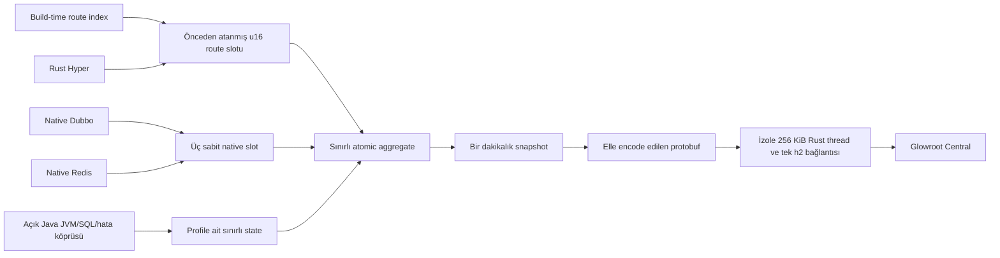

# Upstream Glowroot Analizi ve Tasarım Kararı

[English](UPSTREAM_ANALYSIS.md) | [Türkçe](UPSTREAM_ANALYSIS.tr.md)

## Kapsam

Referans olarak kullanılan Glowroot revision değeri
`622dc6f800228cccc6fa37b0ed9e779446d7c41e` değeridir. Bu checkout değiştirilmez. Yalnız mimari
analizde ve benchmark mock collector protobuf üretiminde read-only olarak kullanılır.
`java-rust-glowroot-agent`, upstream repoyu fork etmez veya shade etmez.

Production collector da fork edilmez veya değiştirilmez. Bu proje yalnız application agent'ı ve
onunla uyumlu Rust-Java native runtime'ı sağlar.

Hedefimiz tam Glowroot agent'tan daha dardır:

- Java handler ve iş mantığı değişmeyecek;
- HTTP, native Dubbo, native Redis, RSS, thread ve exporter sağlık verileri Glowroot'ta görülecek;
- JVM/GC ölçümleri, açık SQL süreleri, sınırlı hata stack bilgisi ve tanılama komutları yalnız geçici
  çalışma profilleriyle açılacak;
- Rust-Java REST'e Java request filter eklenmeyecek; Spring MVC'de yalnız bir sınırlı MVC interceptor kullanılacak;
- state, queue, payload ve reconnect davranışının tamamı sınırlı olacak;
- agent-owned state ve feature sayfaları `1 MiB` altında kalacak; exporter ve profil kaynak bırakma
  işleri Hyper veya uygulama worker'larını kullanmayan tek sınırlı native thread üzerinde çalışacak.

## Tam Glowroot Agent Neleri Yönetiyor?

Upstream agent genel amaçlı bir APM runtime'dır. Daha geniş maliyet, sunduğu daha geniş özelliklerden
gelir. Tek bir dependency kaldırılarak çözülemez.

| Upstream alan | Kod kanıtı | Runtime etkisi |
| --- | --- | --- |
| Java agent başlangıcı | `agent/core/.../AgentPremain.java`, `MainEntryPoint.java` | `Instrumentation` alır, yüklenmiş class'ları inceler ve agent runtime'ını kurar |
| Bytecode weaving | `agent/core/.../init/AgentModule.java`, `weaving/WeavingClassFileTransformer.java` | Transformer, ASM metadata, advice, class cache ve retransform state'i gerekir |
| Plugin discovery | `agent/core/.../config/PluginCache.java` | Plugin descriptor, aspect class ve konfigürasyon runtime'da tutulur |
| Transaction ve trace modeli | `agent/core/.../impl/Transaction.java`, `TraceCollector.java` | Request başına transaction/entry/query state'i ve ayrı collector döngüsü oluşur |
| JVM ve JMX | `agent/core/.../init/GaugeCollector.java`, `live/LiveJvmServiceImpl.java` | MBean discovery, zamanlanmış collection ve JVM operasyonları eklenir |
| Canlı operasyonlar | `live/LiveWeavingServiceImpl.java`, `central/DownstreamServiceObserver.java` | Çift yönlü kontrol, canlı weaving ve remote config yüzeyi oluşur |
| Collector transport | `agent/core/.../central/CentralConnection.java` | Java gRPC ve Netty channel, buffer, event-loop ve reconnect state'i gerekir |
| Java dependency'leri | `agent/core/pom.xml` | ASM, Guava, Jackson, Logback, protobuf, gRPC ve Netty yüklenir |

Bu parçalar tam APM ürünü için doğrudur. Bunları çıkarıp rastgele Java metodu, SQL, JMX, profiler ve
canlı weaving desteği vermeye devam etmek güvenli değildir. Hepsini tutmak ise mikro ajan bellek
hedefiyle bağdaşmaz.

## Reddedilen Tasarımlar

### ANTI-PATTERN: Tam agent'ı shade edip JAR exclude etmek

Transitive exclude yalnız artifact boyutunu küçültür. Geçerli bir runtime sınırı oluşturmaz.
Glowroot core; weaving, plugin, config, logging, protobuf, gRPC ve Netty tiplerini doğrudan kullanır.
Kör exclude, hatayı build aşamasından startup'a veya nadir bir production akışına taşır.

### ANTI-PATTERN: Framework annotation'ları için küçük transformer yazmak

Framework'te build-time route index ve immutable Rust route tablosu zaten vardır. Transformer, bilinen
metadata'yı tekrar üretir. `java.instrument` ve class state'i ekler. Request telemetrisine yeni bir
değer katmaz.

### ACCEPTABLE: Tanılama podları için tam Glowroot agent

Rastgele Java metodu trace'i, otomatik JDBC interception, geniş JMX discovery, sürekli profiler, log
veya canlı weaving gerekiyorsa upstream Glowroot kullanın. Mikro ajan yalnız açıkça tanımlanan sınırlı
SQL sürelerini, sabit JVM/GC ölçümlerini, sınırlı hata stack bilgisini ve yetkili dump komutlarını
sağlar. Upstream agent için ayrı pod memory bütçesi ölçün. Bu kullanım `micro` içinde otomatik
fallback değildir.

### BEST: Framework'e özel Rust telemetri düzlemi

Build-time route bilgisini ve native veri düzlemi hook'larını kullanın. Java JAR dosyasını tek class
konfigürasyon bootstrap'ı olarak tutun. Yalnız gerekli public protobuf alanlarını encode edin. Veriyi
tek ve sınırlı Rust h2 bağlantısıyla gönderin.

## Uygulanan Runtime

Request akışı önceden atanmış `u16` slot kullanır. Transaction adı, map key, protobuf object, trace
object veya Java callback üretmez. Başarılı HTTP request'leri ağırlıklı ve deterministik olarak
örneklenir. `5xx` hataları tam sayılır. `trace.capacity=0` ise trace kuyruğu ayrılmaz ve yavaş trace
akışı değerlendirilmez.

Exporter ve profil kaynak bırakma döngüsü, `256 KiB` stack kullanan tek Rust thread ve current-thread
Tokio runtime üzerinde çalışır. Bu izolasyon bilinçlidir. Collector DNS, h2 reconnect, protobuf encode,
profil drop ve allocator trim işleri Hyper worker, Spring request thread veya uygulama executor'ını
kullanamaz. Route tablosu, isteğe bağlı profil state'i, h2 window, encode request, timeout ve reconnect
gecikmesi kesin sınırlıdır. Collector kapalıyken retry backlog oluşmaz. Süresi biten interval drop
edilir ve diagnostics sayacında görünür.

`micro`; JVM, SQL, hata stack veya tanılama state'i tutmaz. Geçiş yeni ve sabit şekilli bir profil state'i
oluşturur. Bu state atomik olarak etkinleştirilir. En fazla bir eski state bekletilir. Kontrol API'si,
son referans bırakılıp eski allocation drop edilmeden dönmez. SQL slotlarında generation kimliği
vardır. Eski descriptor yeni açılan profile yanlışlıkla yazamaz.

Seçilmiş JVM ölçümleri upstream benzeri Java gauge collector kullanmaz. Rust, sabit MXBean kümesini
JNI üzerinden bulur, global referansları sahiplenir, izole exporter thread'inden okur ve sonucu
doğrudan encode eder. Tanılama kuyruğu, JVM API çağrısı, dosya işlemi, atomik yayın ve hata temizliği
de Rust'a aittir. Java polling worker'ı, bean listesi, snapshot buffer'ı veya tanılama yardımcı sınıfı
tutmaz.

## Collector Kontratı

Mikro ajan şu mevcut unary mesajları gönderir:

| Glowroot metodu | Gönderilen veri |
| --- | --- |
| `collectInit` | Agent id, host/process/Java bilgisi ve read-only config |
| `collectAggregates` | HTTP, Dubbo, Redis ve açık SQL count, hata, süre, satır ve HdrHistogram bilgisi |
| `collectGaugeValues` | Process RSS, thread sayısı, exporter sağlığı ve isteğe bağlı sabit JVM/GC ölçümleri |
| `collectTrace` | İsteğe bağlı sınırlı HTTP örnekleri ve profile bağlı sınırlı hata stack bilgisi |

Unary aggregate ve trace metotları mevcut şemada deprecated olarak işaretlidir. Buna rağmen test
edilen kontratta hâlâ vardır. Her Glowroot Central yükseltmesinde generated-protobuf protokol gate'i
yeniden çalıştırılmalıdır. Streaming metotlara geçiş gelecekteki uyumluluk işidir. v1 içinde gizli bir
varsayım değildir.

## Production Sınırı

Mikro ajan; rastgele Java metodu, otomatik JDBC proxy veya weaving, bind value, geniş JMX discovery,
log, sürekli profiler, canlı weaving veya remote agent config sağlamaz. Heap ve thread operasyonları
yalnız `diagnostic` profilinde açık, yerel ve yetkili komut olarak çalışır. Sürekli zamanlanmaz. v1
transport düz h2 kullanır. Şifreleme veya workload identity gerekiyorsa localhost mTLS sidecar ya da
service mesh kullanın.

Bu sınır footprint'i koruyan ana özelliktir. Dışarıda bırakılan bir yüzey eklenecekse ayrı mimari ve
yeni RSS/RPS/p99 gate gerekir. Mikro profile sessizce eklenmemelidir.
